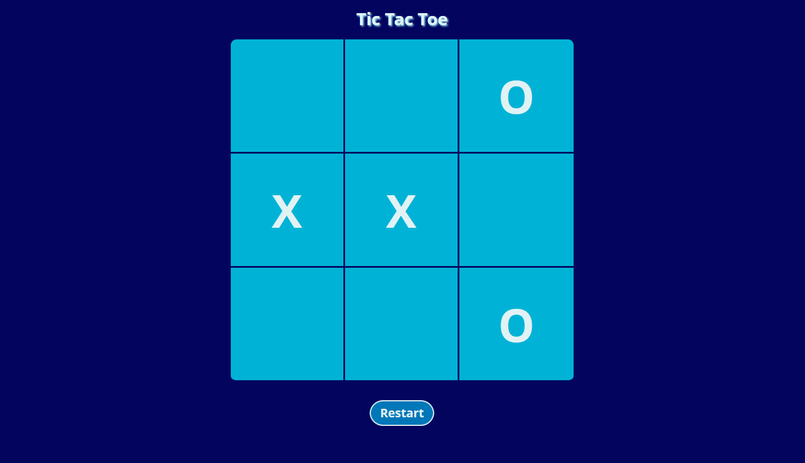

# TicTacToe

## Table of contents

- [Overview](#overview)
  - [The challenge](#the-challenge)
  - [Screenshot](#screenshot)
  - [Links](#links)
- [My process](#my-process)
  - [Built with](#built-with)
  - [What I learned](#what-i-learned)
- [Author](#author)

## Overview

### The challenge

Users should be able to:

- Play one round of TicTacToe and get the results immediately after making a winning move or getting a draw

### Screenshot

### Links

- [Live Site](https://tictactoe-by-me.netlify.app)

## My process

### Built with

- Semantic HTML5 markup
- SASS for handling the CSS properties
- Flexbox and Grid
- Javascript using a Module Pattern approach

### What I learned

Working with Javascript and a module pattern to have no global code. All the code is inside the module called GameModule

## Author

- Frontend Mentor - [@dnewbie25](https://www.frontendmentor.io/profile/dnewbie25)
- DevChallenges - [dnewbie25](https://devchallenges.io/portfolio/dnewbie25)